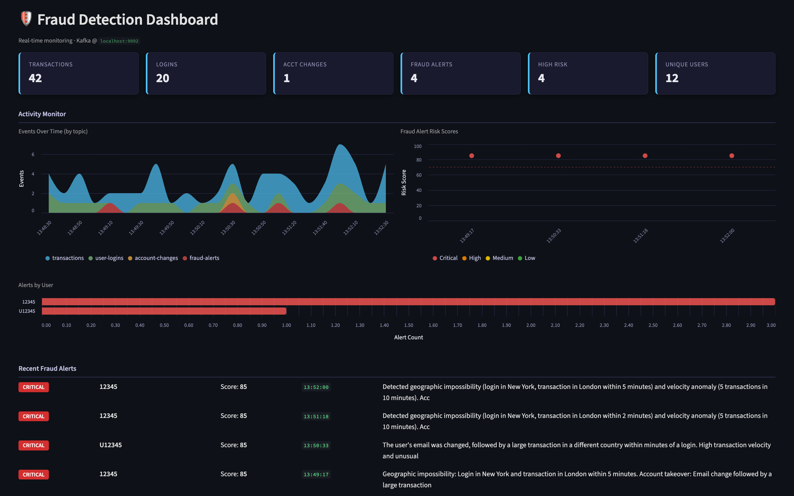

# Real-Time Fraud Detection with Confluent Intelligence Streaming Agents

[](https://www.confluent.io/get-started/)

<div align="center">
  
</div>

Build a real-time fraud detection system with [Confluent Cloud Streaming Agents](https://docs.confluent.io/cloud/current/ai/streaming-agents/overview.html). Streaming user activity is windowed with **Confluent Cloud for Apache Flink** and analyzed by a **Streaming Agent** (Confluent Intelligence) backed by **AWS Bedrock (Claude)**, which reasons over each user's behavior, calls tools, and emits fraud alerts in real time. A local Python producer generates synthetic events and a local Streamlit dashboard visualizes the results.

Everything except the producer and dashboard runs in Confluent Cloud — there is no local Kafka or Flink.

<table>
<tr>
<th width="25%">Stage</th>
<th width="75%">What happens</th>
</tr>
<tr>
<td><strong>1 · Ingest</strong></td>
<td>A producer streams synthetic <code>transactions</code>, <code>user_logins</code>, and <code>account_changes</code> (~80% normal, ~20% fraud: geo-impossible travel, account takeover, velocity).</td>
</tr>
<tr>
<td><strong>2 · Window</strong></td>
<td>Flink SQL <code>UNION ALL</code>s the three streams, keys by <code>user_id</code>, and collects each user's activity into a 3-second event-time <code>SESSION</code> window — one clean profile per activity burst.</td>
</tr>
<tr>
<td><strong>3 · Reason &amp; act</strong></td>
<td><code>AI_RUN_AGENT</code> runs a <code>CREATE AGENT</code> Streaming Agent (Bedrock Claude) over each profile. It scores the activity and calls function tools — <code>flag_transaction</code>, <code>freeze_account</code>, <code>notify_user</code> — during its reasoning.</td>
</tr>
<tr>
<td><strong>4 · Alert</strong></td>
<td>The agent's JSON verdict (risk score, reasoning, actions, flagged ids) is written to the <code>fraud_alerts</code> topic and rendered live on the Streamlit dashboard.</td>
</tr>
</table>


## Prerequisites

**Required accounts & credentials:**

- **A Confluent Cloud account** + a **Cloud resource management** API key & secret ([create one](https://docs.confluent.io/cloud/current/security/authenticate/workload-identities/service-accounts/api-keys/manage-api-keys.html)).
  [](https://www.confluent.io/get-started/)
- **An AWS account with Amazon Bedrock access** — an IAM user with a long-lived access key & secret and the `bedrock:InvokeModel` permission.
- **Claude model access enabled in Amazon Bedrock** (region **`us-east-1`**). Bedrock does **not** enable third-party models by default — you must request/enable access to Anthropic Claude on the **Model access** page once. See [Add or remove access to Amazon Bedrock foundation models](https://docs.aws.amazon.com/bedrock/latest/userguide/model-access.html). Without this, deploy succeeds but no alerts are produced (Bedrock returns AccessDenied).

**Required tools:**

- **[Terraform](https://github.com/hashicorp/terraform)**
- **[Git](https://git-scm.com/)**
- **[Python 3.11+](https://www.python.org/downloads/)**

<details>
<summary>Installation commands (Mac / Windows)</summary>

**Mac (Homebrew):**

```bash
brew install git python && brew tap hashicorp/tap && brew install hashicorp/tap/terraform
```

**Windows (winget, PowerShell):**

```powershell
winget install Git.Git Python.Python.3.12 Hashicorp.Terraform
```

**Optional — maintainers only, to rebuild the UDF JAR:**

```bash
# Mac
brew install colima docker && colima start
```
```powershell
# Windows
winget install Docker.DockerDesktop
```
</details>

## 🚀 Quick Start

**1. Clone the repository:**

```bash
git clone https://github.com/confluentinc/demo-confluent-fraud-agent.git && cd demo-confluent-fraud-agent
```

**2. Provide your four credentials:**

```bash
cd terraform
cp terraform.tfvars.example terraform.tfvars
# edit terraform.tfvars — Confluent Cloud key/secret + AWS Bedrock IAM key/secret
```

These four values are the **only** inputs. Region (`us-east-1`), the Claude model, resource names, and sizing are all preset.

**3. One-command deployment:**

```bash
terraform init && terraform apply
```

This provisions everything — environment, Kafka cluster, Schema Registry, Flink compute pool, the Bedrock connection, the model, the UDF tools (JAR upload + functions + tools), the agent, and the detection query — and writes a ready-to-use `.env` for the local apps.

**4. Install the Python dependencies:**

<details open>
<summary>macOS / Linux</summary>

```bash
cd .. && python3 -m venv venv && source venv/bin/activate && pip install -r requirements.txt
```
</details>

<details>
<summary>Windows (PowerShell)</summary>

```powershell
cd .. ; python -m venv venv ; venv\Scripts\Activate.ps1 ; pip install -r requirements.txt
```
</details>

**5. Start the producer** — in one terminal, generate events:

```bash
python producer/generate_events.py
```

**6. Start the dashboard** — in a **second** terminal, launch the UI at http://localhost:8501:

```bash
streamlit run dashboard/app.py
```

> Activate the virtual environment in each new terminal first (`source venv/bin/activate`, or `venv\Scripts\Activate.ps1` on Windows).

That's it! Watch fraud alerts appear in real time — the injected scenarios surface as high-risk alerts (scores ~75–95) with `freeze_account` / `flag_transaction` actions and the flagged transaction ids.

> [!NOTE]
> The dashboard reads from `latest`, so keep the producer running and allow ~1 minute for the first window-firing batch of alerts. You can also inspect the running statements and tables in the [Flink workspace](https://confluent.cloud/go/flink).

## 🎬 Demo walkthrough

Deployed and running? Follow the **[guided demo walkthrough → `demo.md`](demo.md)** — a ~15-minute, screenshot-by-screenshot script that traces the pipeline through **Stream Lineage** (source topics → the Flink Streaming Agent with union, tools & AI agent → the alerts topic) and finishes on the live dashboard.

## Directory Structure

```
demo-confluent-fraud-agent/
├── terraform/                       # One-step Confluent Cloud provisioning (start here)
│   ├── main.tf                      # Env, cluster, SR, compute pool, service account, keys, ACLs
│   ├── flink.tf                     # Bedrock connection, tools artifact, and all Flink statements
│   ├── connect.tf                   # Writes .env for the local apps
│   ├── variables.tf                 # The 4 required inputs
│   └── modules/flink-statement/     # Reusable confluent_flink_statement wrapper
├── tools-udf/                       # Java UDF tools (flag/freeze/notify) + pre-built JAR
├── producer/generate_events.py      # Synthetic event generator
├── dashboard/app.py                 # Streamlit real-time dashboard
└── requirements.txt                 # Local app dependencies
```

## How the agent's tools work

The agent calls three function-based tools — `flag_transaction`, `freeze_account`, `notify_user` — implemented as Flink UDFs in `tools-udf/` and uploaded as a Flink artifact. They are **mock** actions (each returns a confirmation string, no real side effect) but are genuinely invoked by the agent during tool-calling. To change them, edit the Java sources and rebuild with `tools-udf/build.sh` (uses Docker — no host Java toolchain needed), then commit the new JAR. Rebuilding is a maintainer task; running the demo never requires it.

## Troubleshooting

**Dashboard shows no fraud alerts?** The input topics and `activity_profiles` fill but `fraud_alerts` stays empty — check, in order:

1. **Bedrock model access.** If Claude isn't enabled in **Amazon Bedrock → Model access (us-east-1)**, every `AI_RUN_AGENT` call fails with AccessDenied and no alerts are produced. Enable it (see Prerequisites).
2. **Is the `detect-fraud` statement RUNNING?** In the [Flink workspace](https://confluent.cloud/go/flink), check the `detect-fraud-…` statement isn't `FAILED`. The agent is configured with `handle_exception = 'continue'` and `max_consecutive_failures = '5'` so a stray malformed model response doesn't kill it — if it still fails, inspect the statement's error detail.
3. **Give it ~1–2 minutes** with the producer running. The dashboard reads from `latest`; alerts arrive in window-firing batches and high-risk ones are ~1 per cycle.

Verify the stages directly in the Flink workspace:
```sql
SELECT * FROM activity_profiles;            -- should fill (windowing works)
SELECT * FROM fraud_alerts WHERE risk_score >= 70;   -- the high-risk verdicts
```

## Cleanup

```bash
cd terraform && terraform destroy
```

This removes the entire Confluent Cloud environment (cluster, topics, schemas, Flink resources) in one step.

## Sign up for early access to Flink AI features

For early access to new Flink AI features, [fill out this form](https://events.confluent.io/early-access-flink-features) and we'll add you to our early access previews.
