# Demo Walkthrough — Real-Time Fraud Detection with Confluent Intelligence Streaming Agents

A ~15-minute guided walkthrough to run **after deployment**. It follows the data left-to-right through **Stream Lineage** — from the source topics, into the Flink Streaming Agent, out to the alerts topic — and finishes on the live Streamlit dashboard.

**The story in one line:** synthetic user activity streams into Confluent Cloud, a Flink **Streaming Agent** (Bedrock Claude) reasons over each user's behavior and calls tools to act, and fraud alerts surface in real time — all without leaving Confluent Cloud.

---

## Section 1 — The data sources: what's flowing in

**1. Open Stream Lineage.** From your [Confluent Cloud cluster page](https://confluent.cloud/go/cluster), click on **Stream Lineage** for the cluster. You'll see the whole pipeline as a graph: the producer on the left, the three source topics, the Flink jobs and the `activity_profiles` topic in the middle, the `fraud_alerts` topic, and the dashboard consumer on the right. This one view *is* the architecture — live.

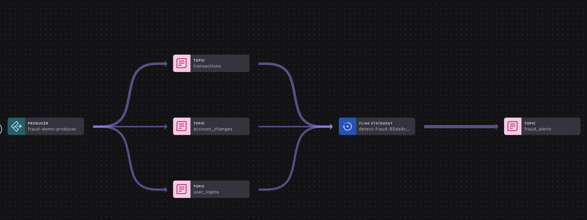


**2. Click the producer (`fraud-demo-producer`).** This is our event generator simulating real customer activity — about 80% normal behavior and 20% injected fraud. In a real deployment this node would be your apps, mobile clients, or existing Kafka producers. Note the production rate flowing into the topics.


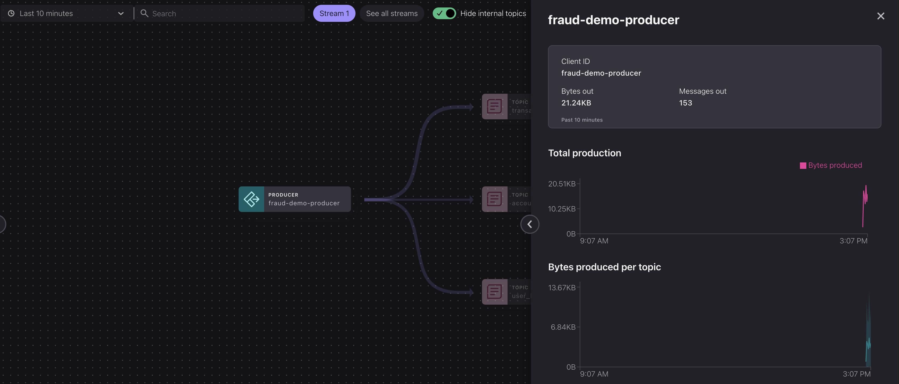


**3. Click the `transactions` topic.** Open its details to show throughput and the **schema**. Click on **Messages** tab to view messeges coming in realtime. Each record is a purchase: `amount`, `merchant`, `merchant_category`, `location`, and a `timestamp`. Technically, this is a Schema Registry-backed Avro topic — the schema is enforced and shared with Flink.

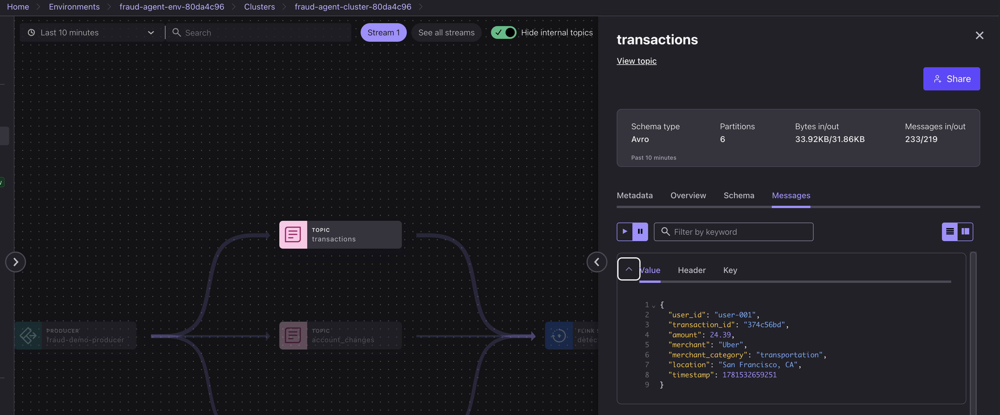


**4. Click the `user_logins` topic.** These are authentication events: `ip_address`, `device_id`, `location`, `timestamp`. On their own they look harmless — but combined with a transaction in another city, they become the **geographic-impossibility** signal.

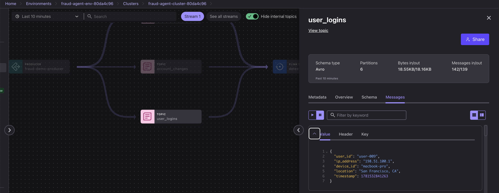

**5. Click the `account_changes` topic.** Email and password changes (`field_changed`, `old_value`, `new_value`). A credential change immediately followed by a large purchase is the classic **account-takeover** pattern.

> [!NOTE]
> Account changes are rarer than transactions and logins, so it may take 1–2 minutes for new messages to show up here.

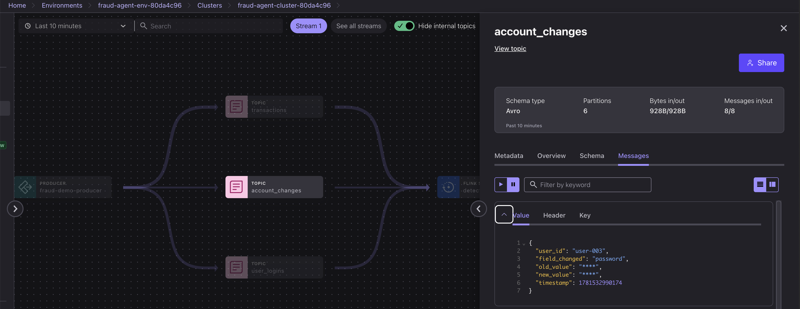


---

## Section 2 — The Flink job: union, tools & the AI agent

**6. Click the Flink jobs in Stream Lineage.** Two always-on Flink SQL statements do the work, and both appear in the graph. `create-activity-profiles-…` reads the three source topics, windows them per user, and writes the **`activity_profiles`** topic; `detect-fraud-…` reads `activity_profiles`, runs the agent, and writes `fraud_alerts`. So the flow is: sources → **activity_profiles** → **fraud_alerts**.

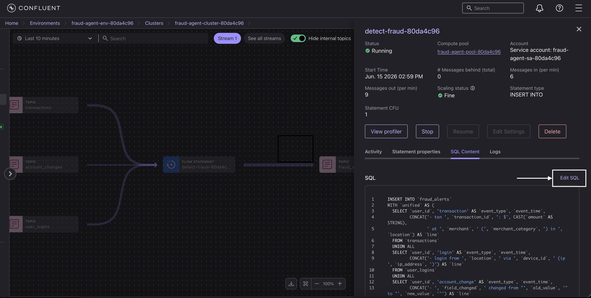

**7. Open the Flink workspace and show the `create-activity-profiles` statement.** Walk through the SQL. First, the three differently-shaped streams are combined with **`UNION ALL`** into one per-user activity stream — transactions, logins, and account changes side by side for each `user_id`.

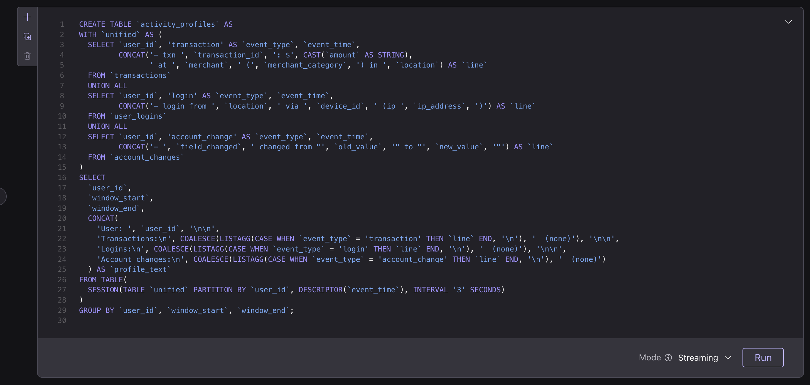

**8. Explain the session window — and see it.** This is a **`SESSION` window**, *not* a fixed-interval (tumbling) one. Flink keeps adding a user's events to the same group for as long as they keep happening, and only closes the window after the user goes quiet for **3 seconds** — the 3 seconds is the **inactivity gap** between events, not a fixed bucket length. So a window is as long as the burst of activity that fills it: a quiet user's window closes, and their next event opens a brand-new one. Each closed window becomes one tidy "activity profile" (grouped by event time), giving the agent the full context of what the user just did rather than one isolated event. 

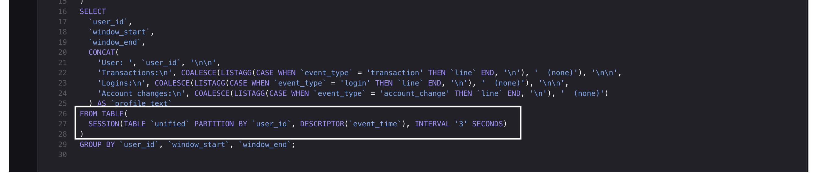


Because we materialize it as the `activity_profiles` table, you can show the windows live:

```sql
SELECT * FROM activity_profiles;
```

Each row is one user's session window (`window_start`, `window_end`) with the exact `profile_text` the agent receives.

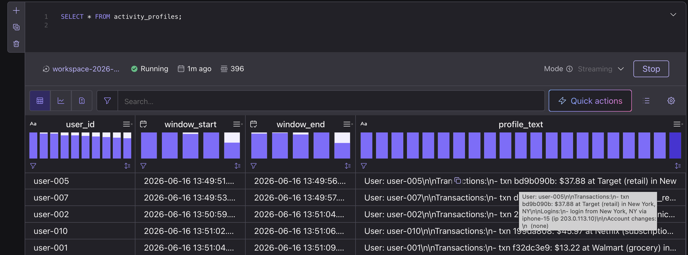

> [!NOTE]
> Steps 9–11 stay in the **Flink** UI — the model, tools, and agent are Flink *objects*, not data flows, so they don't appear in Stream Lineage. View each from **[Flink → Statements](https://confluent.cloud/go/flink)** (the completed `create-model-…`, `create-tool-…`, and `create-agent-…` statements — click to see the SQL), or run `SHOW MODELS;` / `SHOW TOOLS;` / `SHOW AGENTS;` in the workspace. You return to Stream Lineage in Section 3.

**9. Show `CREATE MODEL` (Bedrock Claude).** The agent's brain is a remote LLM registered as a Flink model — Anthropic Claude on AWS Bedrock. Confluent Cloud calls it inline as part of the stream; no separate serving infrastructure.

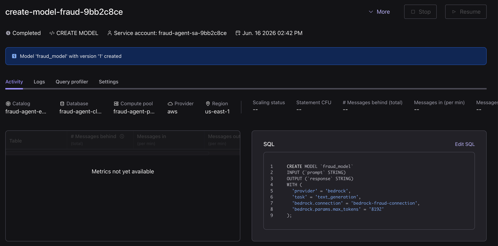

**10. Show the tools (`CREATE FUNCTION` + `CREATE TOOL`).** Three tools the agent can call — `flag_transaction`, `freeze_account`, `notify_user` — implemented as Flink UDFs (uploaded as a JAR artifact). These represent the real actions a fraud system would take. The agent decides *which* to call and *when*. Below is the `freeze_account` tool:

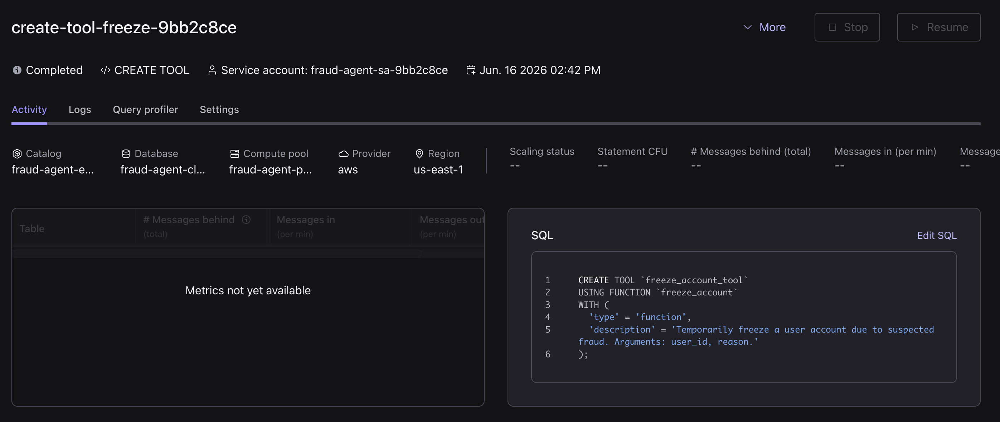

> [!TIP]
> These are **function-based tools backed by Flink UDFs** — Java `ScalarFunction`s packaged into a JAR, uploaded as a Flink artifact, and registered with `CREATE FUNCTION` + `CREATE TOOL`. The actions run natively in Flink with no external service. (Streaming Agents also support **MCP-based tools** for calling out to remote systems.)

**11. Show `CREATE AGENT`.** This is the Streaming Agent definition: a prompt (the fraud-analyst instructions + scoring rubric), the model, and the tools it's allowed to use.

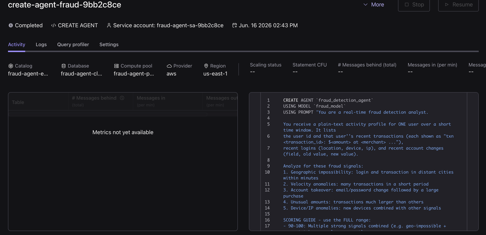

<details>
<summary><strong>How does the agent decide?</strong> (click to expand)</summary>

For each activity profile, the agent:

1. **Reads the activity** — the user's recent transactions, logins, and account changes from the session window.
2. **Looks for the fraud signals** named in its prompt — geographic impossibility, velocity (many rapid purchases), account takeover (credential change → big purchase), and unusual amounts.
3. **Scores the risk 0–100** using the rubric in the prompt — multiple strong signals → 90+, one strong signal → 70–89, mildly unusual → 20–44, normal → under 20.
4. **Acts based on the score** — calls `freeze_account` + `notify_user` for high risk, `flag_transaction` for medium, or nothing for normal activity.
5. **Returns a verdict** — a JSON object with the risk score, plain-English reasoning, the actions taken, and the specific flagged transaction IDs.

It's the LLM making a judgment from those instructions — **not hard-coded if/else rules**. That's why it can explain its reasoning in plain English, and why scores may vary slightly between runs.

</details>

**12. Show `AI_RUN_AGENT` in the detection statement.** The `detect-fraud-…` statement reads each row of `activity_profiles` and hands its `profile_text` to the agent via `AI_RUN_AGENT`. The agent reasons step-by-step, calls tools as needed, and returns a structured verdict, which the query parses into the `fraud_alerts` columns (risk score, reasoning, actions taken, flagged transaction ids).

This agent isn't a service you call on a schedule — it's **always on and event-driven**. The statement runs continuously, and **the data itself is the trigger**: the moment a user's session window closes, that profile flows in and the agent runs on it automatically. No cron, no polling, no orchestration — new behavior arrives, the agent reacts.

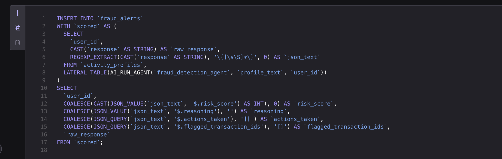

---

## Section 3 — The output & the dashboard

**13. Back in the [Stream Lineage UI](https://confluent.cloud/go/cluster), click on **Stream Lineage** and then click the `fraud_alerts` topic.** This is the agent's output stream — one verdict per user activity window. Show alerts arriving in real time.

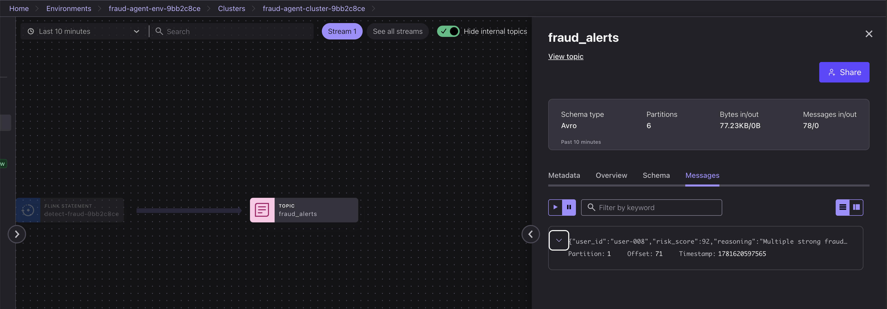

**14. The verdicts are structured, queryable data.** In the Flink workspace, filter to the fraud the agent caught:

```sql
SELECT * FROM fraud_alerts WHERE risk_score >= 70;
```

The key point here is *shape*: the agent's free-text answer has been parsed into typed columns — `user_id`, `risk_score`, `reasoning`, `actions_taken`, `flagged_transaction_ids` — so the verdict is queryable, joinable, and can drive downstream alerts. (We'll read the reasoning and see the action play out on the dashboard next.)

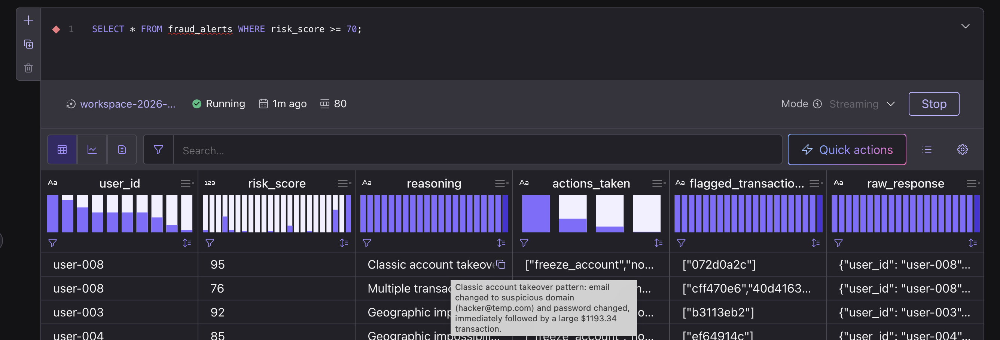


**15. Open the Streamlit dashboard (`http://localhost:8501`).** Show the top-line metrics (events by type, fraud alerts, high-risk count, unique users) and the activity/risk-score charts updating live.

> [!NOTE]
> Give the dashboard ~30 seconds to populate — it reads from the latest offset, so metrics, charts, and alerts fill in once new events and verdicts arrive.

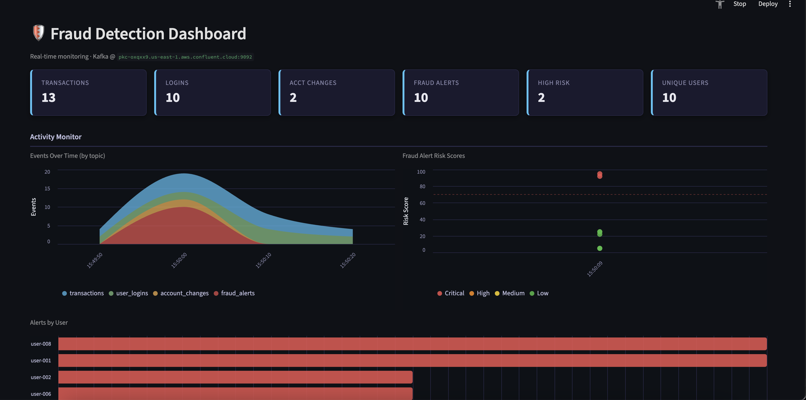

**16. On the same dashboard, scroll down to the Recent Fraud Alerts table.** Find a **CRITICAL** row (score 90+) — a geo-impossible or account-takeover case — and read across it: the agent's plain-English **reasoning** and, in the **Actions** column, what it did (`freeze_account` + `notify_user`). This is the payoff — the same verdict you saw in Flink, now in front of a fraud analyst, seconds after the behavior happened.

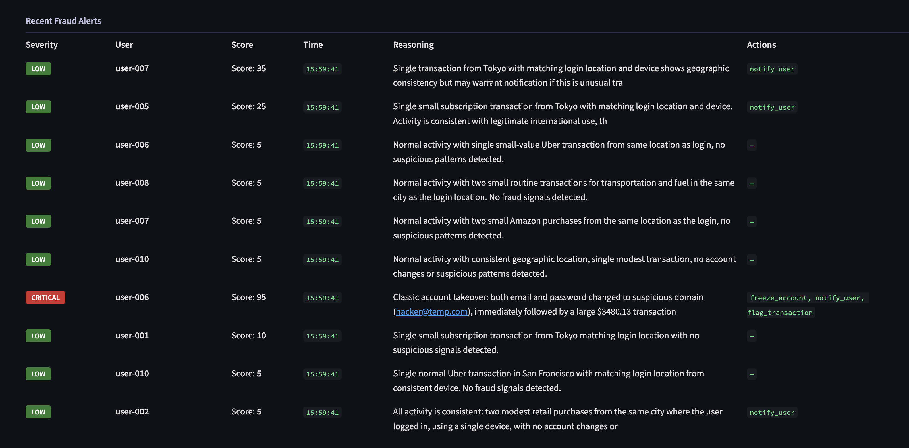

**17. Wrap up.** Recap the journey across the lineage graph: raw events → unioned & windowed per user → reasoned over by an LLM agent that calls tools → structured alerts → live dashboard. All event-driven, all in Confluent Cloud, with no model-serving or orchestration infrastructure to manage.

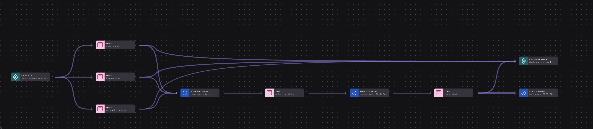

---

## Conclusion

In ~15 minutes you've walked a complete, real-time fraud-detection pipeline running entirely on Confluent Cloud:

- **Raw events** stream in from three topics — transactions, logins, account changes.
- A Flink **`SESSION` window** groups each user's burst of activity into one profile.
- A **Streaming Agent** (Bedrock Claude) reasons over each profile and **calls tools** to act on it.
- Structured **fraud alerts** surface in real time on the dashboard — with the agent's reasoning *and* the action it took.

No model-serving stack, no orchestration, no glue services — just declarative SQL and an agent, **event-driven and always on**: new behavior arrives, the agent reacts.

## Tear down

When you're done, remove all the Confluent Cloud resources so you stop incurring cost — see the [Cleanup instructions in the README](README.md#cleanup):

```bash
cd terraform && terraform destroy
```
